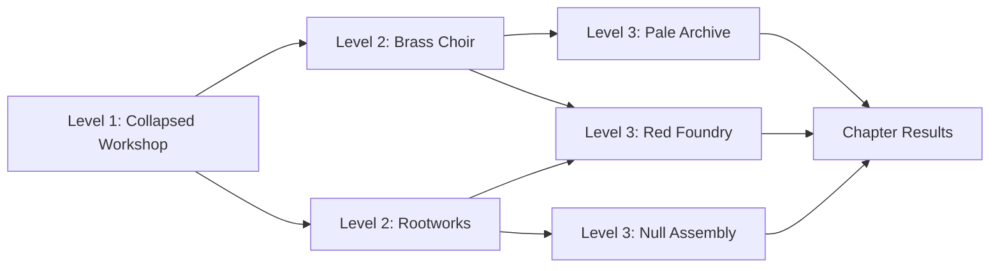

# Multi-level pilgrimage: review and delivery plan

Status: design plan, not implemented. Reviewed 2026-09-20 against 97d4f4a. Existing manifested relic work is retained; the Saint sprite remains unchanged.

## Recommendation

Make the First Pilgrimage one continuous three-level expedition across the six existing sites. Show its map before departure, then let players commit to the next destination after each boss. Carry the same build through the journey. Each stop should feel like a complete level with its own arrival, escalation, boss and conclusion.

Use the existing content before adding more worlds. A new player starts at the Collapsed Workshop. The first victory reveals a choice of two middle levels; the middle victory opens two connected finales. Completing a finale ends the run. A future site-practice feature may permit short replays, but it is not required for the main flow and must not silently bypass expedition progression.

## What the current game actually does

- Six authored sites form four valid three-site paths. Frame and Blessing setup always starts at the Workshop.
- Workshop uses eight 70-second waves; middle sites use four 50-second waves; finales use three 40-second waves. Their scheduled combat budgets total 14 minutes 40 seconds, excluding shops and roads; bosses can end final waves earlier.
- The first map opens after Foreman. It shows the route graph and a selected assignment's description, travel cost, risk and news. Destination previews are chosen through buttons; drawn map nodes are not the primary input controls.
- Each road has two authored choice stops. Purchases, ranks, relics, Gifts, currencies and health carry between sites. Arrival recovery raises health to at least 60% for middle sites and 80% for finales.
- Route admission currently costs Scrap. Foreman grants 8 travel Scrap; middle sites grant route salvage. Paid road options coexist with free alternatives. Preserve these guarantees while changing the presentation.
- Boss defeat is enough to advance in main mode. Repairs remain optional rewards even where route descriptions still imply otherwise.
- Site memories lead back to the map or to chapter Results. Saving is manual through the existing save path; there is no automatic checkpoint at each route transition.
- Persistent profile updates happen at run Results. `Profile.record_run` checks `result.route_id` for the Brass/Rootworks unlock conditions instead of the visited route history. At a terminal ending, that ID names the finale. This can miss the earlier branch unlock; it must be fixed before treating profile unlocks as an authoritative replay catalogue.

Review evidence: expedition-map tests passed 36 checks and chapter tests passed 131 checks. The existing map capture harness produced seven configured map/road images; the first map was visually inspected. These checks establish the current flow, not pacing or enjoyment. No fresh full human playthrough is claimed.

## Route graph

The First Engine is the larger story horizon, not a seventh promised level for this chapter. All four paths should be viable with evolved or unevolved builds. Route choice never checks for Mercy Rail or any specific relic.

## Screen flow

| Screen | Player decision | Handoff |
|---|---|---|
| Main menu | Continue or New pilgrimage | Continue restores the exact checkpoint; New opens setup without erasing the existing save merely by browsing |
| Frame and Blessing | Choose the run's starting identity | Open the chapter map preview |
| Departure map | Inspect the journey; start the Workshop | Only the Workshop is launchable; future branches are inspectable, clearly marked as reachable later |
| Level arrival | Read the site name, boss objective and optional opportunity | Brief dismissible card; movement starts only when the player is ready |
| Combat and shop | Survive, acquire relics and decide whether to repair | Existing wave/shop cadence initially retained |
| Site clear | See defeated boss, rewards and a short memory | Record clear once, checkpoint, then open the route map |
| Route map | Preview either connected destination, then Travel | Selection is reversible until confirmation; commit cost once |
| Road | Resolve the existing encounter and optional merchant choice | Show exact health/Scrap changes; checkpoint each accepted choice |
| Next level | Continue with the same build | Show arrival recovery once; reset site-local enemies, hazards and wave state |
| Finale Results | Understand the completed route and build | New pilgrimage or Main menu; no implied next chapter that does not exist |
| Defeat Results | Understand where and why the run ended | Retry as a fresh expedition or Main menu; returning does not restore a pre-defeat checkpoint |

Avoid a chain of separate reward popups. One site-clear screen should combine the boss result, reward receipt and memory, then one Continue action reaches the map. Do not add an extra mandatory shop between that screen and the two existing road stops.

A separate Save and return to title action belongs on paused map, shop and road screens. It suspends the same expedition; it is not extraction or a free heal. No banking or selling a carried build into permanent power.

## Map selection design

Use a dedicated full map screen, with the current build summarized in a compact tray. The current combat HUD's wave and optional-work panels need not occupy map space. Title it **The First Pilgrimage**, with **Level 1 / 3**, **Level 2 / 3** or **Final destination** as appropriate.

The left two-thirds hold the six landmarks and authored roads. The right third holds the focused destination. Mouse click or controller movement selects a reachable node; a separate Travel action commits. Keyboard/controller focus and mouse selection use the same stable site/route IDs. Back before commitment preserves the current run and selected preview.

Distinguish these states with text and shape, not color alone: current site, cleared this run, reachable now, future connection, route not taken, and chapter ending. A node blocked by this run's chosen branch is not described as permanently locked. Profile discovery is a separate small badge; it does not alter legal connections within the active expedition.

Destination panel, in reading order:

1. Site name and illustrated landmark.
2. One sentence describing the combat experience.
3. Threat preview and boss silhouette/name, avoiding an exhaustive counter guide.
4. Optional repair opportunity and its existing reward.
5. Number of waves and a clearly labelled estimated combat duration.
6. Travel cost, current Scrap and the arrival-health floor.
7. A compact road strip: encounter, merchant, destination.
8. The two possible next sites, or **Ends the chapter**.
9. **Travel to [site]** with any unavailable reason stated beside it.

Example Brass card: “Fight through broken signals and moving escorts. Defeat the Choir Regent. Optional relay work grants Scrap.” Show 4 waves, current 8 Scrap admission, 60% arrival floor, and the Archive/Foundry connections. Replace the current imperative “Tune three relay bells” as the main destination promise.

Showing the floor as “Arrival restores you to at least 60% structure” avoids promising a 60% heal. Road damage and arrival restoration must both appear in the consequence preview. Keep the current prices for the first UI implementation; any later toll removal or pacing rebalance requires an explicit economy pass.

## What each level contributes

| Level | Experience | Optional work | Purpose in the run |
|---|---|---|---|
| Collapsed Workshop | Open salvage lanes, basic swarm/charger/ranged introductions, Foreman | Existing press, furnace and bell opportunities | Learn movement and shop; establish a recognizable build |
| Brass Choir | Broken signal rhythms, escorts and Choir Regent pressure | Relay tuning, never defence or an exit gate | Ask how the build handles movement and distributed threats |
| Rootworks | Pipes, service lanes and mutually sustaining machines | Pump work | Offer a contrasting route through crowd sustain and target priority |
| Pale Archive | Ordered records, constrained firing opportunities and existing copied geometry | Record recovery | A finale about positioning and handling the Archive's existing rules |
| Red Foundry | Furnace lanes, visible hazard closures and pressure to keep moving | Venting work | A finale about space and movement, reachable from either middle route |
| Null Assembly | Quiet machinery, visible suppression and erasure anchors | Anchor work | A finale about timing and positioning; review any loss of automatic attacks for clarity and frustration |

These are refinements of existing site identities, not requests for new counterplay systems. Do not tailor a destination to a required weapon, manual interrupt or repair duty. Review existing suppression/copy mechanics before adding anything to them.

## Pacing hypothesis

The current eight/four/three-wave split makes the Workshop dominate and the final destinations feel like short extensions. First make the existing transitions legible and measure real sessions. Only then test a stronger level arc.

A candidate target is 7–9 minutes of Workshop combat, 4–5 minutes at the middle site and 3–4 minutes at the finale, plus paused decisions. Treat these as hypotheses, not a time estimate for the current build or a commitment to longer sessions. Keep one primary pressure per wave and give each boss a recognizable entrance and resolution. Measure time spent shopping and reading separately from combat.

Do not add waves simply to meet a duration. A longer level needs a new pressure beat, a meaningful purchase or a changed spatial question. Finale pacing must let the completed build feel powerful before the boss tests it.

## Carryover, checkpoints and profile rules

Carry relic ranks/evolutions, reserve, catalysts, Gifts, currencies, health and route history. Do not reroll the build or require a new Blessing between sites. Retain existing site reset and arrival recovery behavior; do not extend a temporary effect into the next site unless its existing rules permit it.

Proposed checkpoints are created after validated commands at site clear, route commitment, each road choice and arrival. Write atomically using a temporary file and replacement, retaining a last-known-good backup. Resume restores the exact phase, offers, seed/RNG state, selected route and remaining road nodes. UI preview changes alone do not commit a route or create rewards.

Separate durable discovery receipts from unfinished run state. Use a stable run ID plus site ID for exactly-once clear credit. Fix branch discovery to consume `route_history`/completed site facts rather than final `route_id`. Previously completed sites may initialize discovery when migrating an older profile; merely seeing a future map node must not unlock it. Keep earlier valid discoveries after a later death, without granting another chapter reward on repeated load.

Do not enable arbitrary destination starts by calling `enter_destination` with an empty build. That function currently expects a developed expedition. A future practice mode needs explicit loadout presets, separate records and a clearly labelled non-expedition result; defer it from this delivery.

## Implementation packets

| Packet | Scope and likely files | Acceptance |
|---|---|---|
| M1 — first | Navigation and destination clarity in `game/main.gd`, chapter descriptions in `content/chapter/first_chapter.json`, map/flow/UI tests | Departure preview reaches setup/run correctly; six nodes inspectable, only legal nodes selectable; map controls work by mouse/keyboard/controller; repairs described as optional; Travel commits exactly once; no simulation step during map reading |
| M2 | Site-clear summary and automatic checkpoint lifecycle in main, simulation save contract and profile; migration/save/profile tests | Save/quit/load at every boundary preserves hashes and offers; failed write keeps prior save; death cannot resurrect old run; clear/unlock rewards credited once; route-history unlock regression passes |
| M3 | Distinct arrival/site-clear presentation and normal-speed pacing review; chapter/arena content only where observations justify it | All four paths complete; zero-Scrap continuation guarantees hold; no-repair and non-evolved paths remain viable; record combat/decision time, confusion and boss readability |
| M4 — deferred | Discovered-site practice and later chapter catalogue | Explicit fresh/preset build policy, separate rewards, no bypass of expedition records; implement only after the three-level expedition is satisfying |

M1 does not require more weapons, character replacement, a procedural map, a hub world or a new currency. Maintain the completed manifested-relic work and keep its human readability review alongside M3.

## Review exit criteria

A newcomer can identify where the current run ends, what carries over, which two sites are available, what a choice costs and whether repairs are optional. Returning players can deliberately choose any of the four legal paths. Saves work across map/road/site boundaries without losing a run or farming rewards. Review one complete human run through each branch family and record observations; automated outcomes alone do not prove these criteria.

Exactly one next implementation task: M1, the departure map preview and clearer between-level destination selection, preserving current chapter rules.
