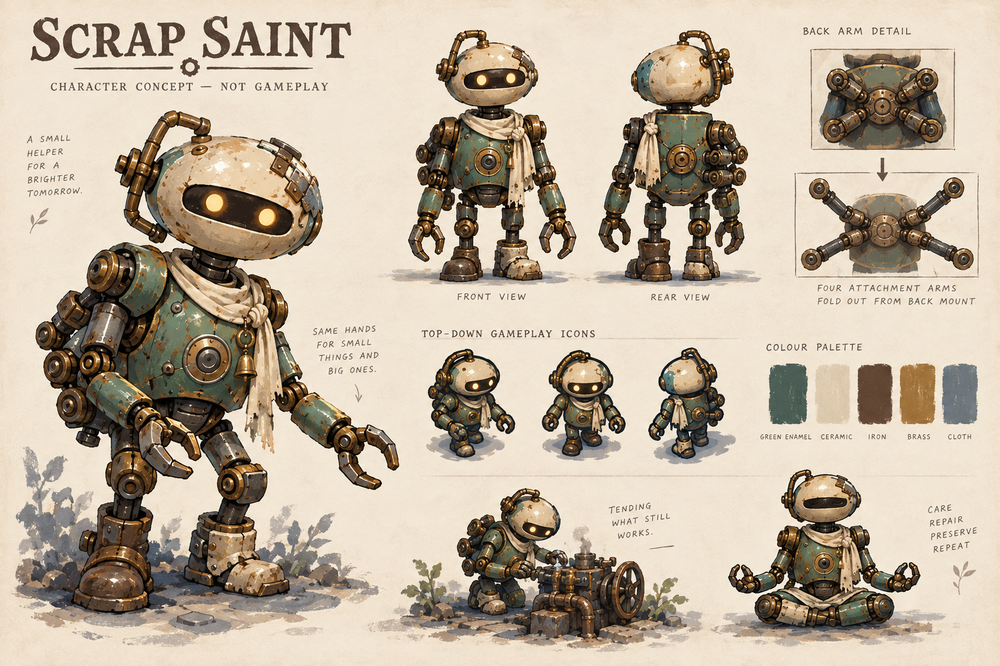
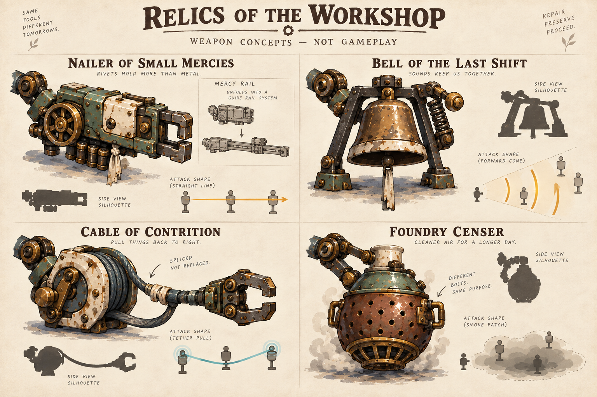
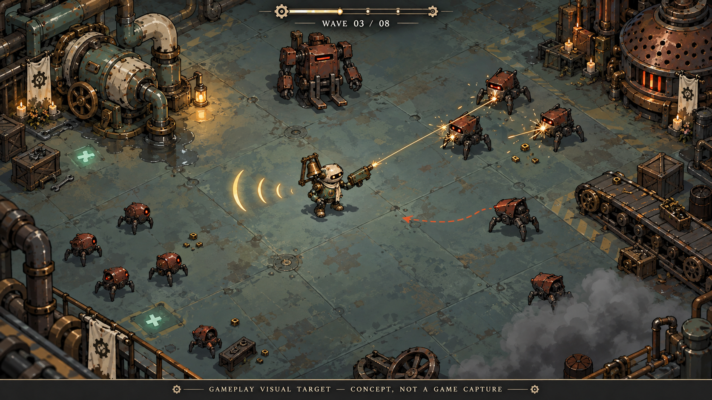

# Scrap Saint: production visual target

Status: proposed production direction, with generated concept boards. These images are designs, not captures from the game or finished animation assets. The current runtime remains unchanged.

## Current implementation decision — 2026-09-18

Weapons manifest; the current playable Saint sprite stays unchanged for now. Use the relic concepts for brief event-driven weapon appearances and attack effects. Persistent orbiting relics retain their active visuals. Attachment arms, physical mount sockets and the replacement character rig described below are deferred concepts, not dependencies. The menu artwork remains unchanged.

The current first slice is the manifested Nailer and Mercy Rail, followed by Bell, Cable and Censer, then a four-weapon readability pass. The [roadmap](../roadmap.md) governs implementation order. Presentation must preserve simulation timing, targets and outcomes.

## The decision

Build a painted 2D industrial diorama around a small machine whose repairs are visible. Large cream and green shapes identify the Saint; bronze mechanisms identify its relics; dark iron and rust identify corrupted machines. Grace appears in a careful repair, a warm eye or a useful tool responding. Keep religious meaning in gestures and history, with restrained physical devotional objects.

The menu painting establishes atmosphere. The playable art simplifies its surfaces and uses a higher camera. We should be able to recognize the Saint before seeing its bolts, and recognize a weapon before reading its name.

Use layered painted sprites with broad shading, crisp silhouettes and small animated mechanisms. Keep the current 2D simulation and collision geometry. Painted side faces can suggest depth without changing movement axes. The arena board's diagonal floor grid is a composition study, not authorization to convert the game to an isometric coordinate system.

## The Saint: the little caretaker

Choose the large left-hand character as the body/material reference: oversized repaired ceramic sensor housing, two small warm apertures within one dark visor, pear-shaped green service body, mismatched short boots and a narrow cream cloth tied to one side. One cracked head corner carries a substantial staple repair. The head's bent carrying handle is the baseline identifier. A permanent floating halo would compete with the actual Welded Halo relic, so leave it out of the basic frame.

The two apertures are a proposed visual translation of the menu face. They do not add sensors or powers to the lore's singular awakened eye. The body remains a manifestation of repairs freely given, never a factory-built chosen warrior.

Retain six connected arms. Two utility arms move naturally and perform repairs. Four compact folded mount arms sit against the upper ribs/back. They deploy for equipped relics, then settle; they should not stay splayed into a permanent fan during ordinary movement. The menu's meditation pose opens the same six-arm assembly. Four equipment mounts are a presentation of the existing four active relic slots; orbiting or hovering relics still follow their own authoritative behavior. Reserved weapons are stowed, not displayed as a fifth attacker.

The diagram's smaller seated pose hides the folded arms. Do not use it as a six-arm rigging reference. The rear mount detail establishes the intended four additional arm roots, but production needs a clean joint map before animation.

Proposed first scale test: a 56–64 pixel standing body at the 1280×800 logical canvas, with a clear head and short foot shadow. This is an art test target, not a new collision radius. Test adjacent smaller/larger variants in the actual arena before locking dimensions. Keep the foot anchor and authoritative hit position explicit.

Animation direction: a slight head lead while walking, a heavier mismatched step, a brief inquisitive inspection tilt, utility hands bracing during repairs and one small shoulder release after completion. Hurt compresses the pose briefly without moving the collision center. Equipped relics animate from simulation events; a recoil animation must never award a second hit.

## Four signature relics

| Relic | Production shape | The repair it remembers | Attack presentation |
|---|---|---|---|
| Nailer of Small Mercies | Long rectangular driver, unequal cream panels, green casing, exposed flywheel and blunt front jaws | Shared repairs to worker homes and bodies; show a household cloth patch and mismatched panels | Carriage pulls back, punch resolves, one short amber line and local sparks; distinguish it from the Hymn Coil's sustained beam |
| Bell of the Last Shift | Broad bronze dome inside a dark A-frame with visible side hammer | A shift bell rung to let exhausted workers stop; a replaced striking face changes its voice | Hammer visibly contacts metal, three spaced forward arcs resolve, then the bell settles; base Bell remains a cone |
| Cable of Contrition | Round reel, offset brake pawl, open clamp and visible U of slack cable | Successive travellers repaired and left the same line for the next person | Clamp reaches a valid target, slack snaps taut and the reel responds; keep target endpoints visible |
| Foundry Censer | Heavy hanging filter pot, repaired lid, ceramic neck and a short lifting bracket | Clean steam carried through a sickroom after the factory stopped paying | Pot rocks and vents into a low readable zone; smoke never covers the Saint or enemy silhouettes |

These designs retain existing stable IDs and gameplay roles. The board's terse captions and attack diagrams are illustrative; simulation targeting, timing, ranges and damage remain authoritative. A painted tether or straight line is not evidence that the current base rank can hit every depicted target.

The Censer should preserve its sickroom/filter history. The illustration's furnace-like perforations are useful material language, but production should emphasize seals, filter lid and the ceramic outlet rather than glowing fire inside a weapon bomb.

### Mercy Rail transformation

Retain the Nailer casing and its household repairs. Rank progression makes the existing carriage and jaws more readable; evolution unfolds two long guide rails and reveals a travelling rivet carriage. A longer silhouette and unmistakable straight resolve communicate the transformation. Do not brighten the entire screen or require a special enemy encounter. The player should see the same humble tool accomplishing something larger.

The expansion drawing on the board is a shape sketch. Production needs closed, opening and locked-rail views with pivot points. The maximum attack extent always comes from the simulation, not the drawn barrel length.

## The arena target

Preserve broad walkable ground, low-contrast floor planes and machinery grouped into recognizable landmarks. Put the richest material detail on the pump, furnace and boundary machinery. Corrupted bodies retain their former jobs: round sorting mites, low triangular inspection hounds and a square forklift brute.

The readable hierarchy is player head and immediate danger first, enemy bodies next, active attack geometry next, then pickups and repair cues, then background detail. Danger must remain readable without relying on hue alone: charges need a clear directional boundary, pickups a cross or recognizable scrap shape, and relic attacks their own line/cone/tether/zone geometry.

Proposed palette, to validate in-engine:

| Purpose | Color |
|---|---|
| Deep floor/contact shadow | #15272D |
| Quiet workshop plane | #344B4D |
| Saint enamel | #57766A |
| Saint ceramic | #E4D6B9 |
| Brass mechanisms | #B68B4D |
| Corrupted iron | #493D36 |
| Threat rust | #B86545 |
| Repair accent | #A7DFC4 |

Keep cream highlights strongest around the player. Reserve mint for recovery and readable optional work. Neither the scenery nor every relic needs an emissive outline.

### Corrections to the arena illustration

The depicted Saint is larger than the proposed runtime scale. Its floor has too many small scratches for a dense late wave. The lower-right smoke is too opaque. The charge cue curves, whereas production must show the simulation's actual path. The decorative top bar is not a HUD specification. The rivet traces imply a multi-target arrangement that must not override the actual weapon rank. Use the image for material, spacing and contrast direction, with these corrections carried into implementation.

## Deferred character and attachment-rig handoff

Create the Saint as separated head, visor/eyes, torso, cloth, two legs, two utility arms and four mounting-arm chains. Preserve shared anchors between directional views. Each relic needs a body, moving mechanism, mount socket and event-driven resolve/aftermath layer. Render at higher resolution than display scale, then inspect actual-size samples; do not ship the concept board by slicing its views into an animation atlas.

For a later character-replacement phase, deliver idle, walk, repair and hurt views for the Saint. The current first art slice only manifests the Nailer and Mercy Rail around the existing sprite. Include base, rank and evolution distinctions, normal/reduced effects, and a four-relic stress scene. Reuse authored simulation events and test the foot anchor against collision geometry. Test normal gameplay before extending the treatment to every frame and weapon.

Acceptance must include actual-size recognition against workshop floors, visibility during overlapping attacks, contrast without color, and stable joint/weapon anchors through directional changes. Concept-board thumbnails do not establish these results.

## Design review

The character establishes a warm, recognizable face and a practical six-arm solution. The weapon board offers four strong outer shapes with shared material language. The arena board establishes a coherent world, with the readability corrections above still required. Fine scratches and small cloth details are optional polish after the large shapes work.

Exactly one next task: implement the manifested Nailer and Mercy Rail visual slice while preserving the current Saint sprite.
