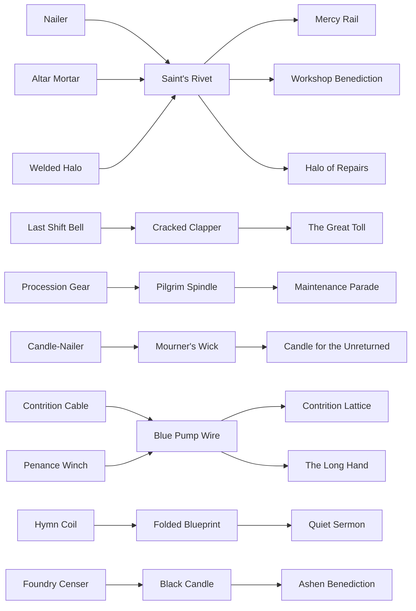

# Weapon, Evolution, and trait animation map

**Runtime reference:** `0.6.0-preview`

**Status:** all mechanics in the relationship map are enabled. P18/P19 implement the described procedural four-beat presentation for all ten base/Evolution families; final asset art, audio feel and human timing validation remain open.

**Authoritative data:** [`content/items/first_slice.json`](../content/items/first_slice.json) and [`content/slices/first_shift.json`](../content/slices/first_shift.json).

## How the layers connect

Scrap Saint has four separate build layers. Keeping them separate is important to both the shop and the animation language.

| Layer | Meaning | What the player should see |
|---|---|---|
| Base weapon | The automatic attack and its dominant tactical question. | A stable physical relic silhouette and a recognisable attack geometry. |
| Rank trait | A cumulative Rank II or III behaviour earned by Combine. | One added moving part or altered attack beat; the base identity remains intact. |
| Catalyst and Evolution | A Rank III recipe that transforms the weapon into a named higher form. | The silhouette changes category and the first attack demonstrates the new geometry. |
| Gift | A two-slot run rule with an activation condition or trade-off. | A small attachment on the Saint plus a visible cue when its rule acts. |

Blessings bias the catalogue and add doctrine rules, but do not own weapons. Tags indicate affinity, not a locked recipe.

The shared catalysts create useful competition: Saint's Rivet can complete Nailer, Mortar, or Halo; Blue Wire can complete Cable or Winch. A catalyst is consumed only by the chosen Evolution.

## Complete implemented relationship map

“Trait” below means the named cumulative rank behaviour, not a Gift.

| Base weapon and role | Rank II trait | Rank III trait | Catalyst → Evolution | Strong runtime links |
|---|---|---|---|---|
| **Nailer of Small Mercies** — narrow priority line | **Triple-Pin Magazine:** pierces three aligned machines | **Foreman Notch:** marks support and major machines for 75 ticks | Saint's Rivet → **Mercy Rail** | Workshop tags; marked-target damage; Inspection Lens improves priority information but does not alter damage |
| **Bell of the Last Shift** — emergency cone control | **Wider Mouth:** wider cone | **Double-Struck Clapper:** 72-tick stagger and stronger push | Cracked Bell Clapper → **The Great Toll** | Bell Ward fulfilment marks staggered targets; **Brass Fuse** marks the first Bell stagger for the wave at the cost of 15% slower Bell cycles |
| **Procession Gear** — close orbit defence | **Twin Procession:** two opposed contacts | **Longer Chain:** wider 100-unit orbit | Pilgrim Spindle → **The Maintenance Parade** | Procession service expands orbit-family reach; repair completion extends the evolved outer route; Loose Spring shares that repair-completion moment |
| **Candle-Nailer** — weakest-target execution and recovery | **Paired Wicks:** attacks the two weakest targets | **Returning Motes:** kill motes seek the Saint | Mourner's Wick → **Candle for the Unreturned** | Mourner adds defeat motes; Black Candle adds a mote every sixth defeat while carried; marks on support targets improve the evolved funeral-mote result |
| **Cable of Contrition** — broad approach control | **Braided Line:** 126-tick bind | **Return Pulley:** stronger pull and announced objective-strike cancellation | Blue Wire → **Contrition Lattice** | Cracked Clapper lengthens control while carried; Bell/Nailer marks help focus redirected targets |
| **Hymn Coil** — rapid dense-line suppression | **Wide Winding:** wider beam | **Rest Note:** 60-tick Quiet on hit | Folded Blueprint → **Quiet Sermon** | **Choir Filter** extends suppression of Choir Drones and Rust Pilgrims after Quiet, but reduces beam/silence damage 15%; Quiet Gear cycles it 10% faster while carried |
| **Altar Mortar** — delayed cluster burst | **Larger Font:** larger blast | **Echo Charge:** 78-tick cooldown | Saint's Rivet → **Workshop Benediction** | Workshop affinity; Quiet Gear improves cadence; the Evolution chooses a hostile cluster or a repair target, never both in one shot |
| **Foundry Censer** — close smoke control and Scrap | **Thicker Smoke:** longer slow | **Ember Sieve:** Scrap every second close defeat | Black Candle → **Ashen Benediction** | Mourner/Procession affinity; Black Candle also grants its carried every-sixth-defeat mote until consumed |
| **Penance Winch** — long-range priority pull | **Longer Drum:** 610-unit reach | **Ratchet Lock:** 135-tick bind | Blue Wire → **The Long Hand** | Cracked Clapper lengthens the bind while carried; Quiet Gear improves its long cadence |
| **Welded Halo** — rotating repair contact | **Double Stitch:** stronger objective repair | **Warm Circuit:** stronger Saint repair when no objective accepts the stitch | Saint's Rivet → **Halo of Repairs** | Workshop/Procession affinity; Spare Hand and Loose Spring reinforce the same optional-repair route without changing Halo damage |

All rank traits are cumulative. An evolved weapon uses its authored Evolution rule instead of layering the Rank II/III geometry over the transformed attack.

## Catalyst carry traits

Catalysts are recipe ingredients, but four also affect the run while carried. These effects end when that catalyst is consumed by an Evolution.

| Catalyst | Carried trait | Evolution links |
|---|---|---|
| **Saint's Rivet** | Repair work is 25% faster. | Mercy Rail, Workshop Benediction, Halo of Repairs |
| **Cracked Bell Clapper** | Bell, tether, winch, lattice, and radial control durations are 50% longer. | The Great Toll |
| **Black Candle** | Every sixth defeat leaves a healing mote. | Ashen Benediction |
| **Quiet Gear** | Every weapon mechanism cycles 10% faster. | No enabled Evolution; it is deliberately a pure carried catalyst |
| **Mourner's Wick** | Recipe ingredient only. | Candle for the Unreturned |
| **Blue Wire from the Pump** | Recipe ingredient only. | The Long Hand, Contrition Lattice |
| **Pilgrim Spindle** | Recipe ingredient only. | The Maintenance Parade |
| **Folded Maintenance Blueprint** | Recipe ingredient only. | Quiet Sermon |

## Gift links

Only two Gifts directly rewrite attacks. The others shape repair, targeting information, or the shop; they should not be falsely presented as weapon upgrades.

| Gift | Link type | Weapon relationship and visible cue |
|---|---|---|
| **Brass Fuse** | Direct attack modifier | Bell and Great Toll: the first surviving staggered target in each wave stays Marked; the Bell cycles 15% slower. A fuse on the Bell mount burns down and the target receives gold sparks plus the stable Mark. |
| **Choir Filter** | Direct attack modifier | Hymn Coil and Quiet Sermon: support machines remain suppressed for two seconds after Quiet; beam/silence damage is 15% lower. The sensor filter brightens cyan and affected support enemies show `FILTERED`. |
| **Loose Spring** | Shared trigger | Any completed repair grants a 1.5-second movement burst once per source. It pairs naturally with Halo and Maintenance Parade, whose routes also value repairs, but does not modify their attacks. |
| **Spare Hand** | Shared activity | Optional repairs complete 25% faster while movement inside the work circle is 20% slower. It supports Halo routes but does not alter Halo's repair pulse. |
| **Inspection Lens** | Information | Reveals the next major property and first priority target in exchange for every fifth ordinary Scrap. It helps priority weapons choose a route, but targeting remains simulation-owned. |
| **Black Ledger** | Shop/economy | Dismantling creates a matching shop lead but refunds only 25%. No combat animation is attached to weapon fire. |
| **Honest Scale** | Shop/information | Shows the exact post-purchase slot, resource, and Combine result. No combat effect by design. |

## Base-weapon attack choreography

The current build draws procedural geometry for roughly 230 ms after an attack event. The **target** column adds physical authorship around that already-authoritative resolve without changing hit timing.

| Weapon | Current procedural presentation | Target Prepare → Commit → Resolve → Aftermath |
|---|---|---|
| **Nailer** | Thin gold line; Saint arm turns and recoils. Rank II reaches one more target; Rank III targets retain the gold Mark. | Shoulder bracket locks onto the lane → brass barrel snaps forward and sheds one loose washer → a hard gold nail streak pierces the selected line → small cross-shaped rivet marks remain on hit plates; Foreman Notch stamps the priority target. |
| **Last Shift Bell** | Expanding forward arc; struck targets stagger, move outward, and can show Mark. | Piston compresses and the bell darkens → clapper hits as the bell becomes the frame's brightest object → a cream pressure wave sweeps the full cone → the bell wobbles while enemies lean back with a vibration ring; Rank II widens the mouth and Rank III visibly double-strikes. |
| **Procession Gear** | One or two physical procedural gears orbit continuously; contact emits a small ring. | Gear teeth lift and the orbit guide brightens → the gear rolls into its assigned contact point → the moving metal body supplies the hit geometry → two brass filings and a tiny half-beat hitch sell contact; Rank II adds the opposed gear and Rank III lengthens both chains. |
| **Candle-Nailer** | One or two violet lines snap to weakest targets; defeated targets leave visible motes. | Candle flame bends toward the weakest machine → black-wax pistol rises and its wick pinches thin → violet flare(s) travel with a smoke ribbon → a defeated target leaves a wick and the healing mote curves home; each added target gets a separate ignition beat. |
| **Contrition Cable** | A broad blue arc resolves the sweep; Bound targets retain a line to the Saint. | Side spool accelerates and hook plate turns outward → cable lashes across the cone and catches each valid machine → line tension draws targets inward → blue tension ticks persist, then the return pulley snaps once and cancels any announced strike. |
| **Hymn Coil** | Repeated thick cyan beam lines; Quiet adds cyan brackets to enemies. | Tuning forks converge and the coil fills from copper to cyan → a short mechanical pulse releases → clean, separated beam strokes pierce the densest lane → support rings dim and a muted bar remains; Rank III inserts one visibly silent rest between pulse groups. |
| **Altar Mortar** | Fine origin line plus expanding circular blast and ground ring. | Side drawer loads a mismatched shell and font lid opens → base dips as the shell launches on a visible arc → a square-edged ground seal closes at impact → orange-cream scorch metal cools outward; Rank III's echo spring resets with an audible double click. |
| **Foundry Censer** | Translucent teal close ring and orbiting censer; attack creates a ring pulse. | Chain draws taut and lid vents at the leading edge → censer swings around the Saint → layered translucent smoke defines the slow zone → slowed enemies trail soot; every qualifying defeat is inhaled before one gold Scrap ember drops. |
| **Penance Winch** | Segmented gold line and hook chevron; target is pulled and remains Bound. | Target endpoint and route appear before commitment → three brass arm segments unfold and drive the alignment hook → drum reverses as the enemy travels along the visible tether → arm folds with a heavy ratchet; Rank III keeps the lock tooth visibly engaged. |
| **Welded Halo** | Crooked persistent arc rotates near the Saint; contact and cream-green repair lines flash. | Bright cardinal solder point approaches the contact → gimbal pauses and closes the circuit → rotating contact damages or sends a stitch beam to valid work → repair seam stays cream-green for a beat; Rank II doubles the stitch and Rank III returns warmth into the Saint. |

## Evolution attack choreography

Evolution should begin with a 0.25–0.4 second reconfiguration beat and immediately showcase the new geometry. It must not be communicated by particles alone.

| Evolution | Persistent silhouette | Target Prepare → Commit → Resolve → Aftermath |
|---|---|---|
| **Mercy Rail** | Long pale rail beside the sensor; split Nailer barrel and unfolded alignment arm. | Twin rails separate and Saint braces → a white-hot pin travels between them → one gold-white lane crosses every aligned threat → major hits leave green repair stitches and a brief return circuit to Saint/objective. |
| **The Great Toll** | Open bell shrine above the Saint with detached central striker. | Four cardinal brackets light in sequence → striker hits the open bell → a full cream-gold radial wall expands → staggered machines slide outward with Rung/Marked rings while the bell continues a slow wobble. |
| **The Maintenance Parade** | Four contact gears arranged as two offset escort rings with faded flags. | Inner and outer routes brighten at different tempos → counter-rotating pairs align like a marching column → four physical contacts sweep their rings → a completed repair unfurls flags and visibly extends the gold outer route for four seconds. |
| **Candle for the Unreturned** | Black ceramic reliquary with three faint ready flames. | Three flames bow toward the weakest reachable machines → the reliquary shutters open → three violet funeral shots curve independently → each death blooms into seeking motes; a Marked support death releases the extra mote as a second flame. |
| **Contrition Lattice** | Three small drums and a faint triangular cable frame. | Three anchor points stamp onto the floor around a priority target → drums fire together → taut blue edges form a triangular boundary and only crossing enemies are caught → crossed edges spark, bind, cancel strikes, and redirect alternate targets to opposite sides. |
| **Quiet Sermon** | Pale enamel lens closed around the copper forks. | Lens narrows and sound visibly dampens around the coil → a restrained cyan bar opens → a wide moving silence lane pierces the priority support line → support motion and rings stop, then restart only after the Quiet/Filter state expires. |
| **Workshop Benediction** | Open altar plate and repair drawer rotating behind the Saint. | Altar selects a hostile cluster or eligible work and displays the relevant orange or green seal → shell/repair parcel launches → cluster blast or consecrated repair zone resolves → scorch plates cool on a hit; cream stitches and a restrained glow remain on repair. |
| **Ashen Benediction** | Split censer lid, violet sparks, and a thin soot plume attached to the trail. | Orbiting lid turns toward nearby damaged work or close pressure → chain casts the censer off-centre → black-violet smoke blooms at the offset zone → slowed enemies shed ash; every second defeat releases a seeking violet mote. |
| **The Long Hand** | Folded double-elbow brass arm and enlarged back spool. | A broad route corridor and priority hook point are marked → both elbows extend in sequence → the arm occupies the whole corridor while it binds and drags aligned threats → hooks withdraw from near to far, leaving tension ticks and cancelled-strike sparks. |
| **Halo of Repairs** | Two-ring gimbal floating higher above the Saint with two solder points. | Opposed contacts brighten as the rings counter-rotate → both gimbals pause together → two contact heads strike and a machine-to-Saint repair circuit closes → cream reflections travel back around the rings; the Saint receives the final warm pulse. |

## Animation timing and implementation boundary

| Beat | Ordinary target | Evolved target | Ownership |
|---|---:|---:|---|
| Prepare | 80–180 ms | 140–260 ms | Presentation may animate known weapon readiness; any locked target or delayed hit must come from simulation state/event data. |
| Commit | 40–100 ms | 70–140 ms | Presentation shows the physical mechanism; it never awards damage. |
| Resolve | 50–200 ms | 100–260 ms | Existing authoritative `attack`, `hit`, `repair`, and status events determine targets and outcomes. |
| Aftermath | 180–480 ms | 300–700 ms | Presentation renders status, residue, recoil, and recovery without extending authoritative durations. |

Ordinary attacks should not shake or zoom the camera. Mercy Rail, Great Toll, an Evolution transformation, and boss-rule changes may use a small impulse, never enough to obscure a telegraph. Reduced-effects mode must preserve outer geometry, endpoint, and status icons while removing secondary filings, sparks, smoke layers, and decorative afterimages.

## Presentation implementation order

1. Add a reusable presentation-only weapon timeline with Prepare, Commit, Resolve, and Aftermath phases driven by simulation readiness/events.
2. Complete **Nailer → Mercy Rail** and **Bell → Great Toll** as the reference line and pulse families.
3. Complete persistent-contact families: Procession Gear/Parade, Foundry Censer/Ashen, and Welded Halo/Halo of Repairs.
4. Complete target-link families: Candle/Unreturned, Cable/Lattice, Hymn/Sermon, Winch/Long Hand.
5. Complete Mortar/Workshop Benediction and overlap/accessibility tuning across a four-weapon build.

The acceptance bar is recognition under overlap: at 1280×800 and normal play speed, a reviewer should identify the acting relic, attack area, affected target, and resulting status without reading a debug label.

## Current presentation state and gap

The 0.6.0 procedural renderer supplies presentation-only prepare, commit, resolve and aftermath phases for every enabled base weapon and Evolution. All ten families have a physical Saint-mounted mechanism, authored attack duration, base/Evolution geometry distinction, deterministic particles or residue, and a reduced-effects rendering path. Rank II/III changes appear through added contacts, tines, flames, braces, reach, width or reset hardware where the rank rule affects presentation. Evolution events display family-specific reconfiguration geometry.

This is a complete code-native visual language pass, not final asset art. Configured stills and deterministic tests do not establish human recognition in motion, audio impact, animation comfort at 1×, or rendered minimum-hardware performance. Those questions require an observed real-time session before further timing or density changes.
